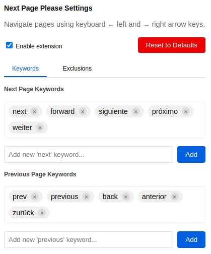

<p align="center">
  
</p>

<p align="center">
  
</p>

# 'Next Page Please' Browser Extension

Navigate through paginated websites using your keyboard's arrow keys. This extension detects "Next" and "Previous" navigation buttons and lets you use your arrow keys to move between pages - no more hunting for tiny navigation links!

## Features

- Use left/right arrow keys to navigate between pages
- Fully customizable keywords - define your own terms for "next" and "previous" buttons
- Customizable exclusion system to prevent conflicts with comment sections or other scrollable areas
- Works across multiple languages and website layouts
- Zero impact on browsing performance when not in use

## Perfect for

- Reading forums and discussion boards
- Browsing product catalogs
- Navigating photo galleries
- Reading paginated articles
- Any site with "Next/Previous" navigation

## Privacy

Works entirely in your browser - no data collection, no external services.

## Customization

Everything is customizable! Define your own navigation keywords in any language and set up exclusion rules to make the extension work exactly how you want it.

## Development

### Prerequisites
- Node.js and npm installed on your system

### Building the Extension

1. Install dependencies:
```bash
npm install
```

2. Build the extension:
```bash
# Build both versions
npm run build

# Or build specific versions
npm run build:v2  # For Firefox (Manifest V2)
npm run build:v3  # For Chrome (Manifest V3)

# Create distribution packages
npm run package   # Creates zip files for both versions
```

Alternatively, you can use the provided package script:
```bash
chmod +x package.sh
./package.sh
```

This will build both versions and create distribution packages in the `dist` directory:
- `dist/v2/` - Firefox version (Manifest V2)
- `dist/v3/` - Chrome version (Manifest V3)
- `dist/next-page-please-v2.zip` - Firefox distribution package
- `dist/next-page-please-v3.zip` - Chrome distribution package

## Installation

### For Development

In Firefox:
1. Clone this repository
2. Open Firefox and navigate to `about:debugging`
3. Click "This Firefox" and "Load Temporary Add-on"
4. Navigate to `dist/v2` and select any file

In Chrome:
1. Clone this repository
2. Open Settings > Extensions
3. Switch on Developer Mode (top right)
4. Click "Load unpacked" and select the `dist/v3` directory

### For Distribution

- Firefox: Use the `dist/next-page-please-v2.zip` file
- Chrome: Use the `dist/next-page-please-v3.zip` file

## License

This project is licensed under the MIT License - see the [LICENSE](LICENSE) file for details.